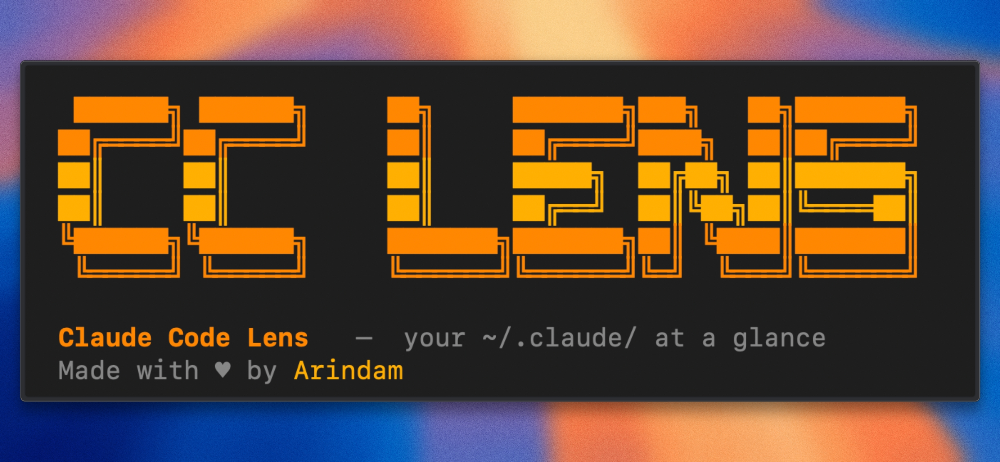

# Claude Code Lens (cc-lens)

Local analytics dashboard for Claude Code. No cloud, no telemetry, no API key, just your `~/.claude/` data, visualized.

```bash
npx cc-lens
```

The CLI finds a free local port, starts the dashboard, and opens it in your browser.

> [!NOTE]
> **cc-lens 0.4.0 is out**
>
> Adds Insights, budgets, team adoption, terminal digest, Wrapped, and expanded project docs.
>
> [View the v0.4.0 release notes](https://github.com/Arindam200/cc-lens/releases/tag/v0.4.0)

## Quick Start

Run directly with `npx`:

```bash
npx cc-lens
```

On first run, `cc-lens` prepares a small runtime cache in `~/.cc-lens/`. After that, launches are faster.

## CLI Commands

| Command | What it does |
| --- | --- |
| `npx cc-lens` | Starts the local dashboard on a free loopback port and opens it in your browser. |
| `npx cc-lens digest --days 7` | Prints a terminal spend digest with sessions, cost changes, cache hit rate, savings, budget pace, and spike alerts. |
| `npx cc-lens digest --team --days 7` | Prints the same digest for team exports loaded from the local team directory. |
| `npx cc-lens push --to <hub-url> --name <you>` | Builds a redacted team export locally and pushes it to a self-hosted cc-lens hub. |

## What You Can See

|  |  |
| --- | --- |
| <h3 align="center">Overview</h3><picture><source media="(prefers-color-scheme: dark)" srcset="./public/dashboard-dark.png" /><source media="(prefers-color-scheme: light)" srcset="./public/dashboard-white.png" />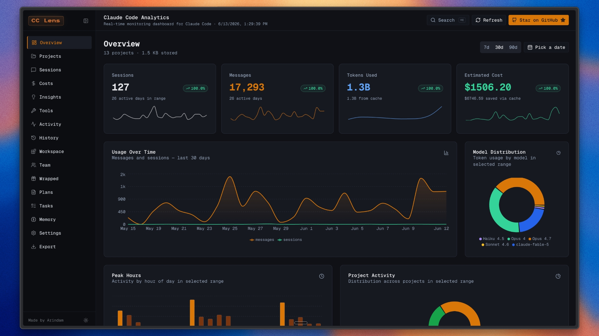</picture><br />Track sessions, messages, tokens, cost, storage, trends, models, peak hours, projects, and recent activity. | <h3 align="center">Sessions</h3>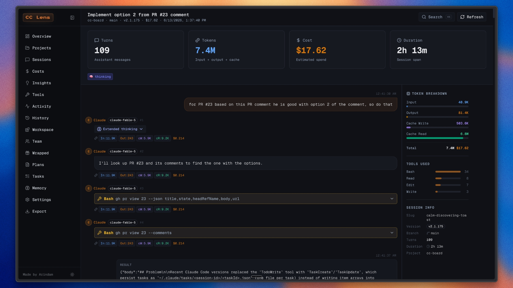<br />Search sessions, replay JSONL conversations, inspect Markdown replies, tool calls, costs, tokens, and compactions. |
| <h3 align="center">Costs</h3>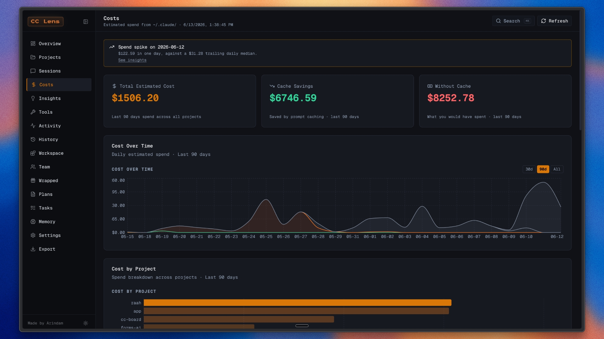<br />Review estimated spend, cache savings, project costs, model breakdowns, token usage, and pricing references. | <h3 align="center">Insights</h3>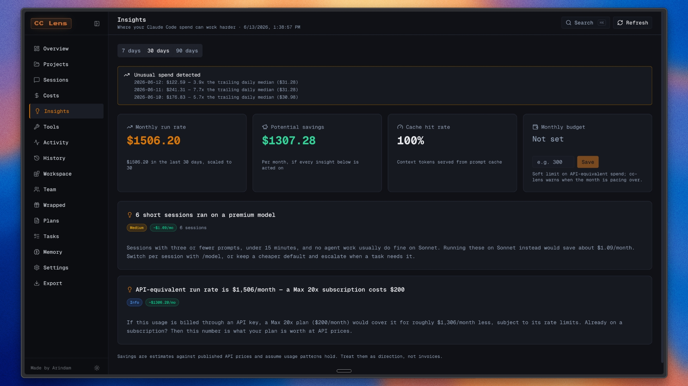<br />Find cache, model, compaction, plan-fit, budget, and savings opportunities from local usage patterns. |
| <h3 align="center">Projects</h3>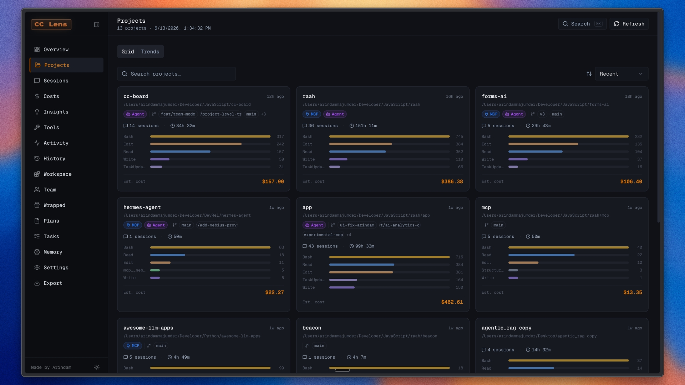<br />Browse projects by sessions, duration, spend, languages, branches, MCP usage, agents, and top tools. | <h3 align="center">Project Trends</h3>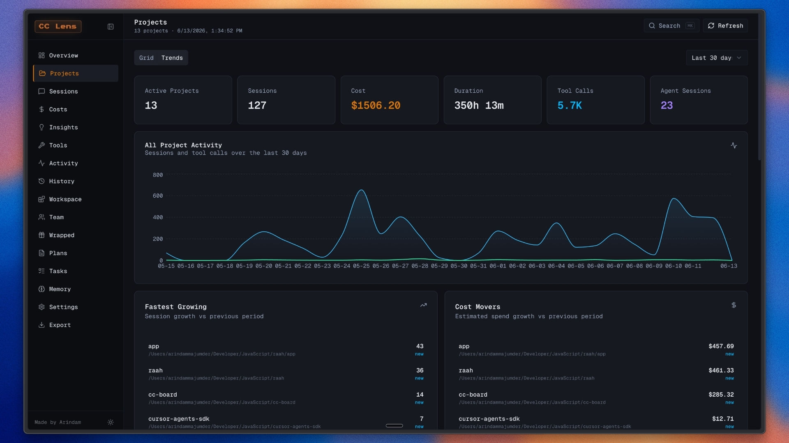<br />Analyze project sessions, spend, language mix, branch activity, model usage, tools, and activity over time. |
| <h3 align="center">Tools & Features</h3>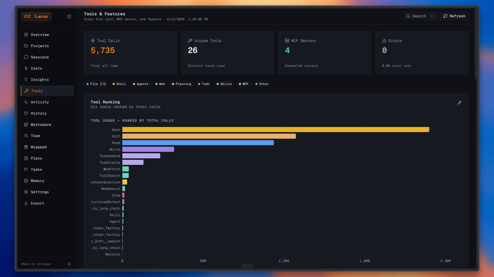<br />Compare tool rankings, categories, MCP servers, feature adoption, errors, versions, and git branch usage. | <h3 align="center">Activity</h3>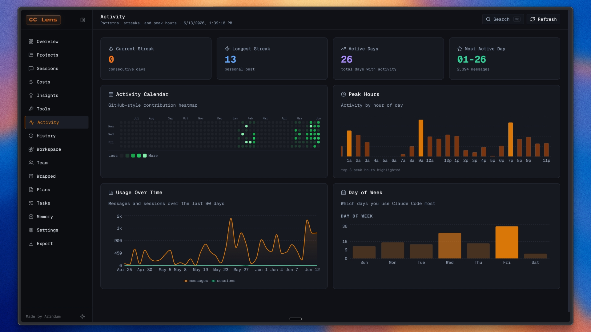<br />View activity calendars, streaks, active days, peak hours, day-of-week patterns, and usage consistency. |
| <h3 align="center">Tasks</h3>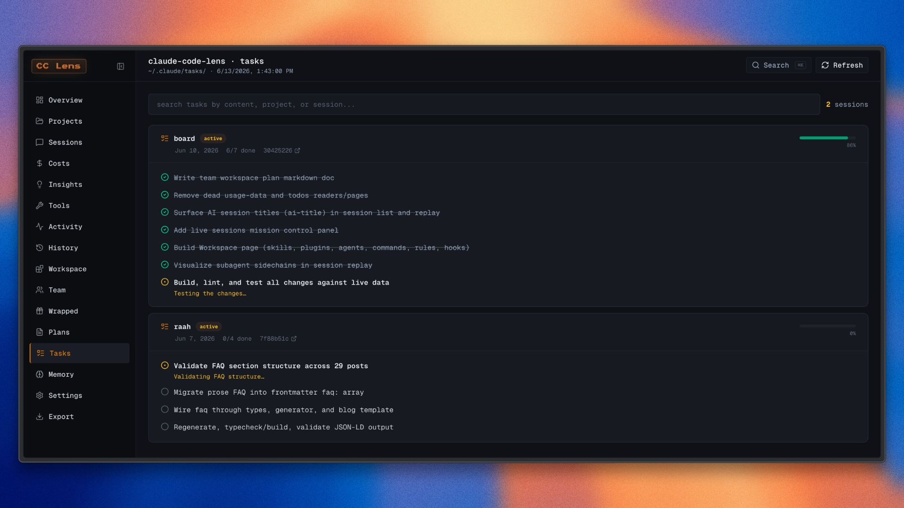<br />Browse Claude Code todos with search, status filters, task metadata, project context, and local file provenance. | <h3 align="center">Workspace</h3>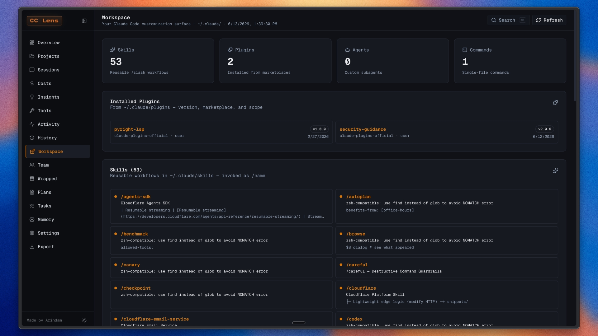<br />Inspect workspace state, memory, settings, installed skills, plugins, MCP servers, and local storage usage. |
| <h3 align="center">Wrapped</h3>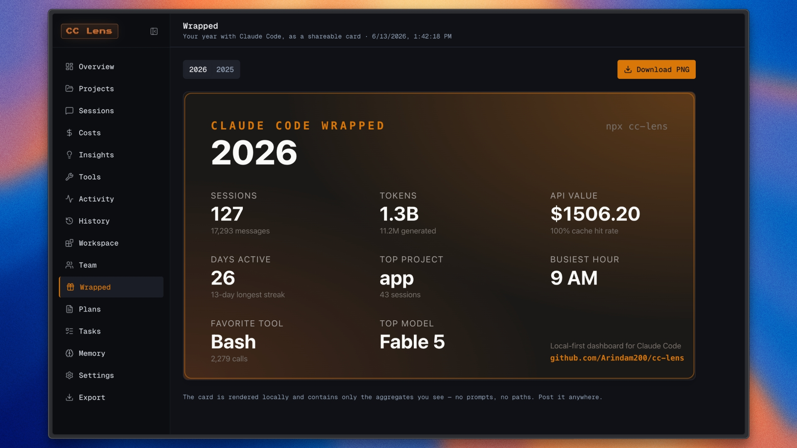<br />Create a yearly card with sessions, usage, spend, favorite tools, active projects, and local highlights. | <h3 align="center">Export & Import</h3>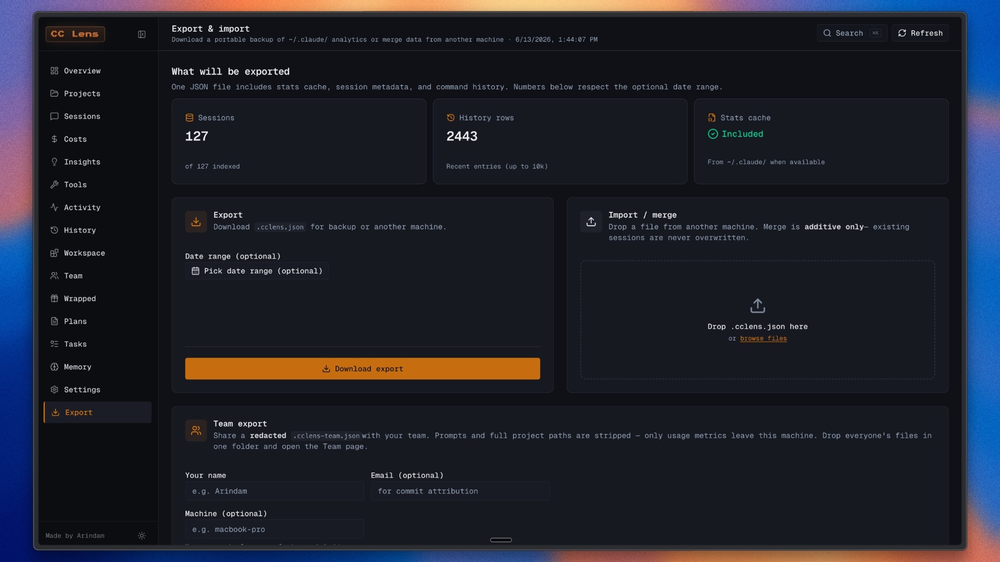<br />Export portable `.cclens.json` files with stats, metadata, facets, history, previews, and date filters. |

Import is preview-only right now. It shows which sessions are new or already present, but it does not write merged data back into `~/.claude/`, to avoid corrupting live Claude Code files.

## Multiple Claude Profiles

By default, `cc-lens` reads `~/.claude/`. To point it at another Claude Code config directory, set `CLAUDE_CONFIG_DIR`:

```bash
# Default profile
npx cc-lens

# Work profile
CLAUDE_CONFIG_DIR=~/.claude-work npx cc-lens
```

On Windows PowerShell:

```powershell
$env:CLAUDE_CONFIG_DIR="C:\Users\you\.claude-work"; npx cc-lens
```

The active config directory is shown in the CLI banner on launch.

## Run From Source

### Prerequisites

- Node.js 20+
- Claude Code with local data in `~/.claude/`

### Development

```bash
npm install
npm run dev
```

Open [http://localhost:3000](http://localhost:3000), or the port shown in your terminal.

### Production Build

```bash
npm run build
npm start
```

For the packaged standalone bundle used by the CLI:

```bash
npm run build:dist
```

### Checks

```bash
npm run lint
npm test
```

## Project Docs

- [Roadmap](./docs/ROADMAP.md): planned improvements and non-goals.
- [Known limitations](./docs/LIMITATIONS.md): accuracy, compatibility, and runtime caveats.
- [Compatibility](./docs/COMPATIBILITY.md): supported local files and reporting guidance.
- [Contributing](./docs/CONTRIBUTING.md): local setup, PR expectations, and manual test notes.
- [Team mode](./docs/TEAM.md): shared-folder team analytics, push hub setup, and terminal team digests.
- [Privacy](./docs/PRIVACY.md): what data is read, exported, or edited.
- [Security](./docs/SECURITY.md): private vulnerability reporting and review checklist.

## Data Sources

`cc-lens` reads local Claude Code files directly:

- `~/.claude/projects/<slug>/*.jsonl`: session JSONL and replay data
- `~/.claude/stats-cache.json`: aggregate stats when available
- `~/.claude/usage-data/session-meta/`: session metadata fallback
- `~/.claude/history.jsonl`: command history
- `~/.claude/todos/`: todo files
- `~/.claude/plans/`: saved plan files
- `~/.claude/projects/*/memory/`: project memory files
- `~/.claude/settings.json`: settings, skills, plugins, and MCP config

Dashboard data refreshes every 5 seconds while the app is open.

## Privacy

Claude Code Lens runs locally and reads files from your machine. It does not require a login, API key, hosted backend, or telemetry service. Your Claude Code history stays on your computer.

## Cost Estimates

Claude Code stores token counts and model identifiers, not final billing totals. `cc-lens` estimates cost using the pricing table in `lib/pricing.ts`. If provider pricing changes, update that file to keep estimates current.

## Star History

<a href="https://www.star-history.com/?repos=Arindam200%2Fcc-lens&type=date&legend=top-left">
 <picture>
   <source media="(prefers-color-scheme: dark)" srcset="https://api.star-history.com/chart?repos=Arindam200/cc-lens&type=date&theme=dark&legend=top-left" />
   <source media="(prefers-color-scheme: light)" srcset="https://api.star-history.com/chart?repos=Arindam200/cc-lens&type=date&legend=top-left" />
   
 </picture>
</a>
